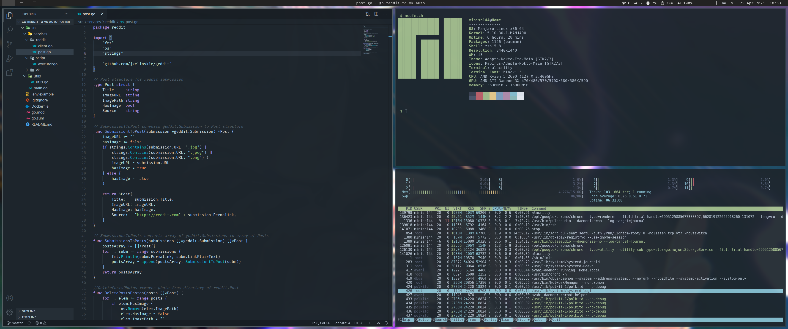
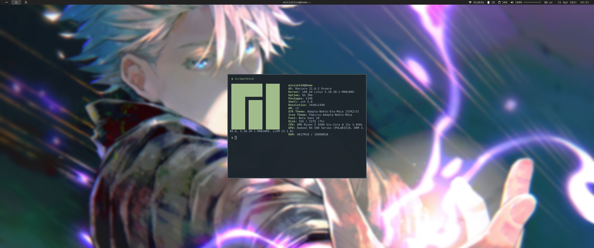

# My Configuration

* Distro: [Manjaro Linux](https://manjaro.org/downloads/community/i3/)

* Theme:Theme: [Adapta-Nokto-Eta-Maia](https://github.com/adapta-project/adapta-gtk-theme)
* WM: [i3-gaps]()

* Compositor: [picom-ibhagwan](https://aur.archlinux.org/packages/picom-ibhagwan-git/)

* Theme:Theme: [Adapta-Nokto-Eta-Maia](https://github.com/adapta-project/adapta-gtk-theme)

* Icons: [Papirus-Adapta-Nokto-Maia](https://github.com/PapirusDevelopmentTeam/papirus-icon-theme)

* Terminal: [Alacritty](https://archlinux.org/packages/community/x86_64/alacritty/)

* VSCode Color Theme: [Tokyo City](https://open-vsx.org/extension/huytd/tokyo-city)

----

[> click for full](https://pasteboard.co/JYZ6Q6n.png)

[> click for full](https://pasteboard.co/JYZ6r3X.png)
